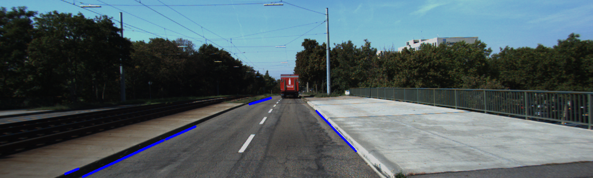

# CV-Road_Segmentation

## Overview
This repository is dedicated to the exploration and application of computer vision techniques for two primary tasks: road line extraction and road segmentation. We leverage a combination of techniques to effectively analyze road images and extract useful patterns.

## Features
- **Region of Interest (ROI)** focusing on specific horizon lines.
- **Thresholding**: Image binarization based on the HSV color scale.
- **Morphological Operations**: Includes erosion, dilation, opening, and closing.
- **Clustering**: Used in segmentation scenarios.
- **Canny Edge Detection**: Applied for edge detection in images.

## Repository Structure
CV-Road_Segmentation
│
├── Clustering_codes/ # Scripts for clustering algorithms

├── Images/ # Miscellaneous images

├── KITTI/ # KITTI dataset specific scripts

├── pycache/ # Python cache files

├── carina_dataset/ # Scripts and data for Carina dataset

├── ic_images/ # Image collection for internal testing

├── Line_extractionOnVideo.py # Script for video line extraction

├── RoadLine_Extraction.py # Script for extracting road lines

├── Road_Segmentation.py # Script for segmenting roads

├── histogram_plt.py # Script for plotting histograms

├── lower_upper_HSV.py # Script for HSV range adjustment

└── morphological_op.py # Scripts for applying morphological operations

## Results
### Orginal image:

  

### Thresholding na escala HSV:

  
  

### Clustering:

  
  

### Canny Edge Detection:

  

### Line Extraction:

  

### Segmentation:

  

## Installation
To get started with this project, clone the repository and install the required dependencies:
   

## Usage

To run the main program, execute:

basH
python Road_Segmentation.py
